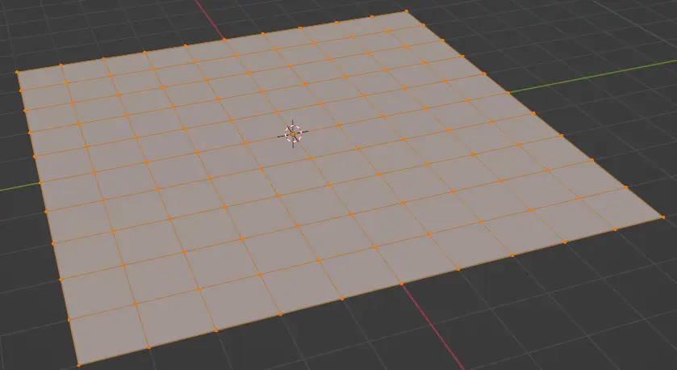
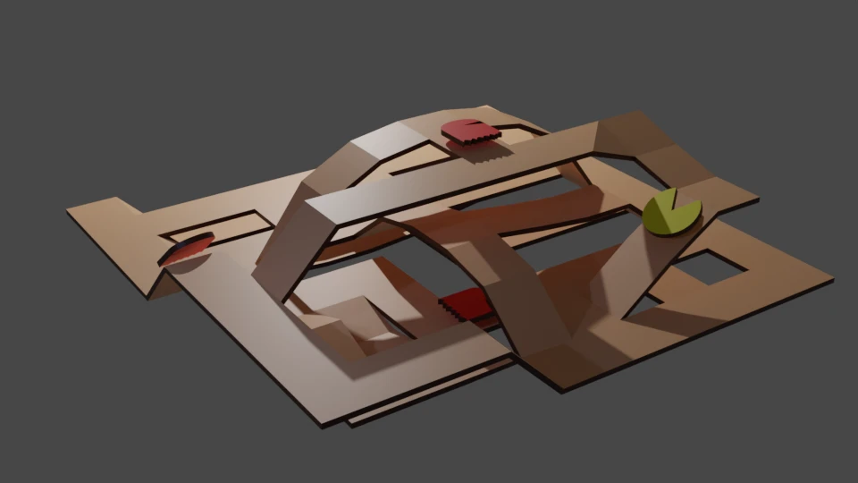

# Et si on faisait un jeu vidéo ?

Ce matin, je me lève et je me dis que je ferais bien un jeu du genre Pac-Man,
mais en 3D et avec un graphisme qui donne l'impression que tout est fait en
carton.

## Le concept

Il me faut donc un concept art. Comme ça va être en 3D, j'utilise Blender et
je commence par me faire un grand plan subdivisé.



Puis je découpe et déplace verticalement des chemins, applique un Solidify et ajoute
un Pac-Man et quelques fantômes. Ça donne à peu près ça :



## Affichage 3D

Ok, alors il va falloir du code pour afficher des polygônes en perspective.
On va donc commencer par programmer un carré à plat sur le sol avec une caméra qui va orbiter autour en le regardant en plongée.

On définit notre caméra par le point qu'elle vise (__target__),
la distance à laquelle se trouve la caméra et deux angles qu'on appellera
__longitude__ (orange) et __latitude__ (bleu).

```g{align:"left"}
O(0,0)
M(O 1 °120)
H(O 1/0.00001 °120)
Z(0,1)
Y(O 1 / 0.5 °60)
X(O 1 / 0.5 °-30)
{OMXYZH}
# 70 %2
@ O 1 / 0.5
@ O 1;180,360
# 10 %1
[OX][OY][OZ]
# 10 %3 [MO] %1 [MHO]
# 20 %2 @ O 1 ; 180 -120
# 30 %2 @ O 0.5 / 0.25 ; 180,30
```

Pour trouver les coordonnées de `M`, on commence par calculer celles de `H`.
Si on suppose que `|OM| = 1`, alors on a `|OH| = cos(latitude)`. Et les coordonnées de `H` sont :

* `Hx = cos(latitude) * cos(longitude)`
* `Hy = cos(latitude) * sin(longitude)`

Et puisque `|HM| = sin(latitude)`, alors les coordonnées de la caméra (`M`) sont :

* `x = cos(latitude) * cos(longitude)`
* `y = cos(latitude) * sin(longitude)`
* `z = sin(latitude)`
