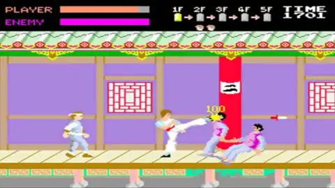
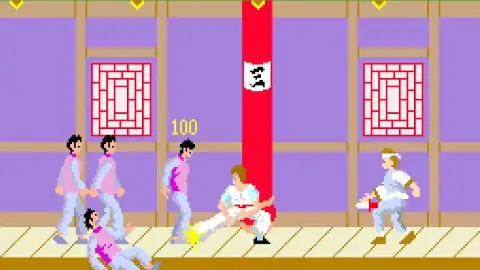
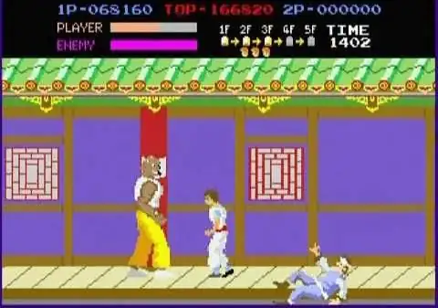

# Kung-fu master

Aujourd'hui, j'ai bien envie qu'on fasse un clone de __Kung-fu master™__.
C'est un jeu sorti en 1984 en arcade et qui s'appelait __Spartan X__ au Japon.

Le pitch est très simple :
le héro se promène avec son compagnon et ils se font agresser par une bande.
Pendant l'affrontement, le compagnon est enlevé par les malfrats.
Peu de temps après, le héro reçoit une lettre lui disant de se rendre au temple du
démon dans lequel il devra affronter les 5 enfants de ce démon.

Le jeu consiste donc à passer 5 niveaux, qui correspondent aux cinq étages du
temple. Des tas d'ennemis se mettent en travers de la progression du héro qui
n'a que ses poingts et ses pieds pour s'en débarasser. Le niveau se termine par
un ennemi plus fort que les autres : le boss de niveau.

Voici quelques images du jeu pour vous donner une idée :

[Suite...](gfx.md)
