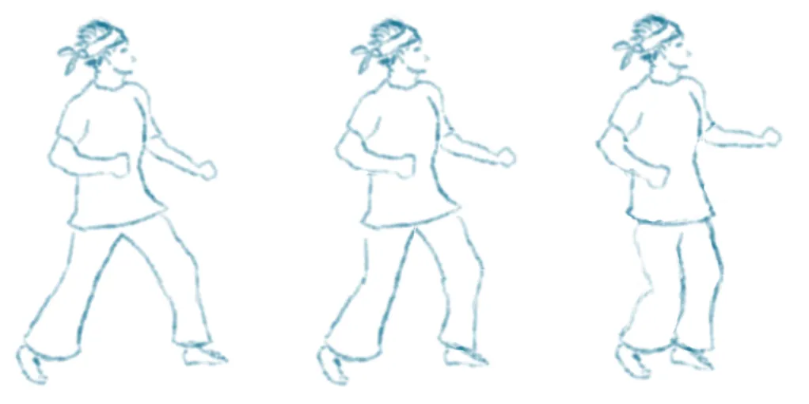

# Kung fu master

## Les graphismes

Pour dessine rles animations des enchaînements de techniques d'art martiaux,
je vais chercher des références sur [YouTube™](#tools/video/) et je
fais quelques croquis pour avoir une base.

Et voici notre toute première animation :

@WalkSketch[{left:0,top:0,width:300,height:510,x:150,y:500},{left:400,top:0,width:300,height:510,x:150,y:500},{left:700,top:0,width:300,height:510,x:150,y:500}]
@WalkSketch[{left:0,top:0,width:300,height:510,x:150,y:500},{left:371,top:0,width:300,height:510,x:150,y:500},{left:701,top:0,width:300,height:510,x:150,y:500}]
